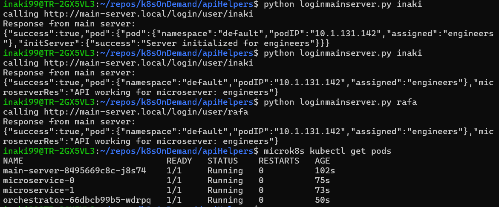
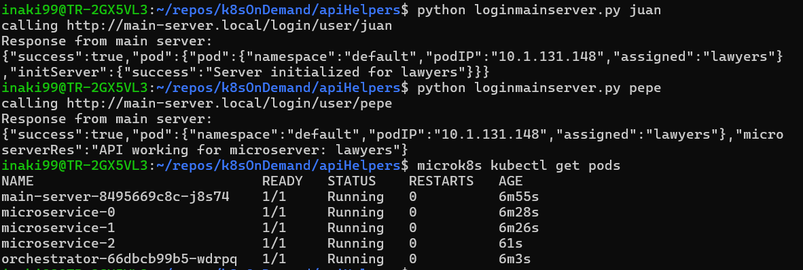
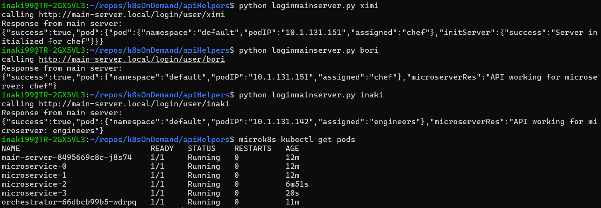

# Diagram
Image of the lucidapp

# Results
All these results run in order from top to bottom

There are not restarts in the results

```
const groups = {
    'engineers': ['inaki', 'rafa'],
    'lawyers': ['juan', 'pepe'],
    'chef': ['bori', 'ximi'],
}
```

-------------------------------------
-----------------------------------------------------

```
[STARTS] 2 microservices
    - microservice-0 = not-assigned-yet
    - microservice-1 = not-assigned-yet
```

First run 
-  "inaki" INITIALIZES the microservice because there are no pods for "engineers" microservice

Second run
- "inaki" Calls directly "engineers" podUrl because microservice has already been started

Third run
- "rafa" Calls directly "engineers" podUrl because microservice has already been started

```
[END] 2 microservices
    - microservice-0 = engineers
    - microservice-1 = not-assigned-yet
```



-----------------------------------------------------
-----------------------------------------------------

```
[STARTS] 2 microservices
    - microservice-0 = engineers
    - microservice-1 = not-assigned-yet
```

First run 
- "juan" INITIALIZES the microservice because there are no pods for "lawyers" microservice

Second run 
- "pepe" Calls directly "lawyers" podUrl because microservice has already been started

```
[END] 3 microservices
    - microservice-0 = engineers
    - microservice-1 = lawyers
    - microservice-2 = not-assigned-yet
```

Orchestrator checks every 15 secs if there are available pods (not-assigned-yet) if not, replicate + 1 `setInterval(checkAndScale, 15000);`

Need available pods ready for a user that might need it for a new user group



-----------------------------------------------------
-----------------------------------------------------

```
[START] 3 microservices
    - microservice-0 = engineers
    - microservice-1 = lawyers
    - microservice-2 = not-assigned-yet
```

First run 
- "ximi" INITIALIZES the server because there are no pods for "chefs" server

Second run 
- "pepe" Calls directly "chefs" podUrl because microservice has already been started

Third run 
- "inaki" Calls directly "engineers" podUrl microservice server has already been started

```
[END] 4 microservices
    - microservice-0 = engineers
    - microservice-1 = lawyers
    - microservice-2 = chefs
    - microservice-3 = not-assigned-yet
```

Orchestrator checks every 15 secs if there are available pods (not-assigned-yet) if not, replicate + 1 `setInterval(checkAndScale, 15000);`

Need available pods ready for a user that might need it for a new user group

