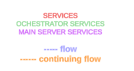
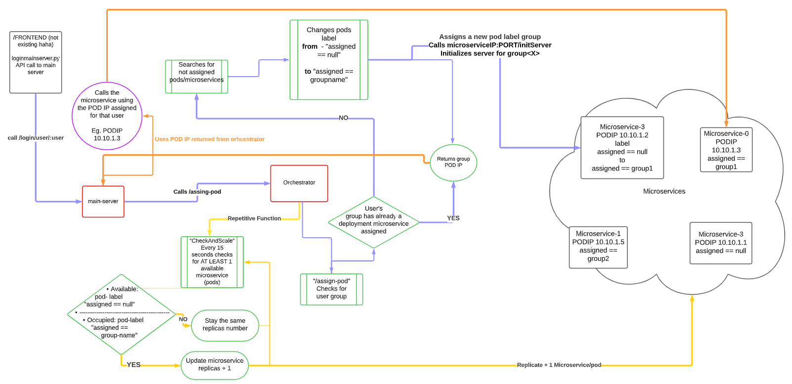

# Code Diagram 
Diagram url

https://lucid.app/lucidspark/25dcdb06-a7bd-4193-a1c7-c2fbfe4aed5a/edit?beaconFlowId=A343DF70A0ADBEBD&page=0_0&invitationId=inv_1509ae1c-aebe-4c96-9f91-db29efde7330#

## loginmainserver.py
Calls the main server login api by user 
`/login/user/:user`

Code running and run explanation in [./results](./results/README.md) 